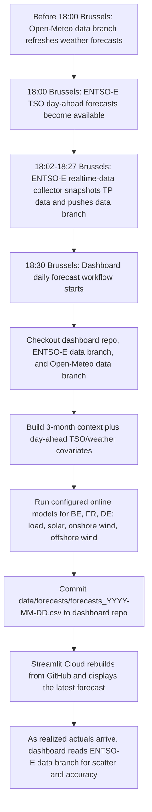

# Real-Time Load and Renewables Forecast Dashboard

Daily online forecasting dashboard for load, solar, and wind in the BE, FR, and DE bidding zones.

The first online version runs once per day at the daily 18:00 Europe/Brussels cutoff, when the first ENTSO-E Transparency Platform TSO forecasts are available. It fetches the latest TSO forecasts and Open-Meteo weather forecasts, builds the agreed feature sets from the latest 3-month context window, runs configured ML/TSFM models, stores the forecasts, and visualizes forecast tracking in Streamlit.

## What Is Included

- Streamlit dashboard with country, target, model, and issue-log views.
- Daily pipeline entrypoint for ENTSO-E and Open-Meteo ingestion.
- Four weather-point configuration per bidding zone and target type.
- Separate load, solar, onshore wind, and offshore wind targets.
- 24-hour daily horizon with 2,208-hour rolling context.
- Pluggable model registry for existing load, solar, wind, ML, and TSFM artifacts.
- Local CSV storage for forecasts, observations, run metadata, and failures.
- Backfill command for missed dates.
- GitHub Actions workflow template for once-per-day execution.

## Quick Start

```bash
python -m venv .venv
source .venv/bin/activate
pip install -r requirements.txt
pip install -e .
cp .env.example .env
streamlit run app.py
```

Run a daily forecast locally:

```bash
python -m rt_forecast_dashboard.pipeline.run_daily --date 2026-08-07
```

Backfill missed days:

```bash
python -m rt_forecast_dashboard.pipeline.backfill --start 2026-08-01 --end 2026-08-07
```

## Credentials

Set `ENTSOE_API_KEY` in `.env` or Streamlit secrets. Without credentials, the pipeline can still create deterministic demo data so the dashboard remains testable.

## Model Artifacts

Place serialized model artifacts under `models/` and update `config/model_registry.yml`.

The initial registry uses robust baseline adapters:

- `tso_reference`: returns the ENTSO-E TSO forecast as the benchmark.
- `ridge_3mo_context`: fits a Ridge model each day on the latest 3 months using selected weather covariates plus TSO forecast.
- `artifact_model`: loads saved artifacts when paths are configured.

Load covariates follow the latest selected feature table:

| Country | Chronos2 | Ridge | TabPFN |
|---|---|---|---|
| BE | Solar + TSO | Temp + TSO | Temp + TSO |
| FR | Temp + TSO | deg_proxy + TSO | Temp + TSO |
| DE | Hum + TSO | Hum + TSO | Solar + TSO |

Solar uses four-point `shortwave_radiation` and `temperature_2m` plus TSO forecast. Onshore and offshore wind use four-point `wind_speed_100m_ms`, `wind_dir_sin`, and `wind_dir_cos` plus TSO forecast.

## Repository Layout

```text
app.py
config/
  zones.yml
  features.yml
  model_registry.yml
src/rt_forecast_dashboard/
  data/
  models/
  pipeline/
  ui/
data/
  forecasts/
  raw/
  issues/
  backfill/
models/
tests/
```

## Deployment Notes

For GitHub Actions, add repository secrets:

- `ENTSOE_API_KEY` for direct ENTSO-E fallback if the realtime-data archive is incomplete.

For Streamlit Community Cloud or Hugging Face Spaces, add the same value to app secrets and mount/persist the `data/` directory if historical tracking should survive redeploys.

## Daily Update Timeline

Scheduled operation follows Europe/Brussels time. ENTSO-E and Open-Meteo API timestamps are still stored and queried in UTC after converting the Brussels cutoff timestamp.



### Operational Map

| Stage | Repository / service | Output | Dashboard use |
|---|---|---|---|
| ENTSO-E snapshot collection | `Energy-Data-Science/entsoe-realtime-data`, `data` branch | TSO forecasts and realized actuals under `data/raw` and `data/updates` | Forecast covariate, 3-month context, realized actuals for diagnostics |
| Open-Meteo weather collection | `XiaoyuJIN97/open-meteo-realtime-data`, `data` branch | Four-point weather forecasts under `data/raw` and `data/updates` | Weather covariates for load, solar, onshore wind, offshore wind |
| Daily forecast | this dashboard repo, `.github/workflows/daily-forecast.yml` | `data/forecasts/forecasts_YYYY-MM-DD.csv` | Deterministic forecast analysis and run history |
| Streamlit display | Streamlit Cloud | Live dashboard | Reads committed forecasts and fetches realized actuals from the ENTSO-E data branch |

The dashboard forecast workflow is scheduled to run at about `18:30 Europe/Brussels` each day. GitHub Actions cron is UTC-only, so the workflow has two UTC cron entries and a Brussels-time guard that lets only the CET or CEST matching run proceed. This deliberately leaves a buffer after the 18:00 Brussels publication time so the ENTSO-E collector can snapshot and push the latest TSO forecasts before forecasting begins.
